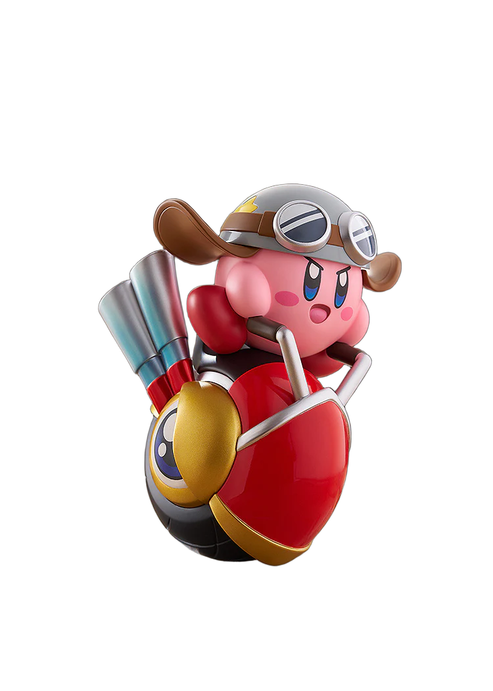

# nukki (배경 제거)

nukki는 BiRefNet 세그멘테이션 모델을 구동해 이미지의 배경을 제거하는 CLI입니다.
[BiRefNet](https://github.com/ZhengPeng7/BiRefNet) 계열 모델을 [rembg](https://github.com/danielgatis/rembg)로 돌립니다.

기본 실행은 **CPU**입니다. Apple Silicon에서 CoreML(ANE/GPU) 가속도 시도할 수 있지만
실험적 옵션(`--coreml`)으로만 제공합니다 — 실측 결과
BiRefNet은 그래프가 워낙 많은 서브그래프로 쪼개져서 최초 1회 CoreML 컴파일에 5분 이상 + 캐시
용량 5GB 이상이 들 수 있었고 그마저도 끝을 보지 못할 만큼 커졌습니다. 컴파일 결과는
`~/Library/Caches/nukki/coreml`에 캐싱되긴 하지만 이 비용 대비 실제 가속 이득이 불확실해서
기본값으로 켜두지 않았습니다.

## 예시

| Before | After (`Vision`) | After (`nukki`) |
|---|---|---|
|  |  |  |

> [!NOTE]
> macOS Preview의 "배경 제거"는 Vision 프레임워크의 `VNGenerateForegroundInstanceMaskRequest`
> 를 온디바이스로 돌려서 나온 결과입니다. 객체 종류를 따지지 않고 전경/배경만 픽셀 단위로 마스킹하는
> class-agnostic 방식이라 빠르지만 머리카락처럼 가는 디테일이나 복잡한 경계에서는 마스크가 뭉개지는 경우가
> 있습니다. nukki는 이 부분을 BiRefNet으로 더 정교하게 잡아내는 걸 목표로 합니다.

## 설치

```sh
pipx install git+https://github.com/AndyH0ng/nukki
```

설치 후 `nukki` 명령을 바로 쓸 수 있습니다. pip으로 설치했는데 `nukki: command not found`가 뜨면,
설치 스크립트가 들어간 디렉토리(사용 중인 venv의 `bin/`)가
PATH에 없는 경우입니다. `python3 -m site --user-base`로 기본 경로를 확인하세요.

## 사용법

```sh
nukki photo.jpg
# -> photo_배경제거.png 생성

nukki *.jpg                        # 여러 장 동시 처리
nukki --model isnet-general-use photo.jpg   # 더 가볍고 빠른 모델 사용
nukki --coreml photo.jpg            # (실험적) CoreML 가속 시도
nukki --verbose photo.jpg           # 실제 사용된 onnxruntime provider 등을 stderr에 출력
```

### 모델 옵션

| 모델 | 특징 |
|---|---|
| `birefnet-general` (기본값) | 품질 우선. 머리카락/복잡한 배경에서 가장 정교함. |
| `birefnet-portrait` | 인물 사진에 특화 |
| `isnet-general-use` | 가볍고(~176MB) 빠름, 품질은 birefnet보다 낮음 |
| `u2net` | 가장 가볍고 빠르지만 엣지 품질이 가장 낮음 |

모델 가중치는 최초 실행 시 자동으로 다운로드되어 캐시됩니다.

## 개발

```sh
uv run pytest      # 단위 테스트 (모델 다운로드 없이 실행되는 순수 로직만 검증)
uv run ruff check .
```

모델 추론 자체는 무거워서(첫 실행 시 대용량 다운로드) 자동 테스트에는 포함하지 않았습니다.
수동으로 `nukki --verbose some.jpg`를 실행해 결과와 로그를 확인하세요.

## License

MIT — see [LICENSE](./LICENSE).
